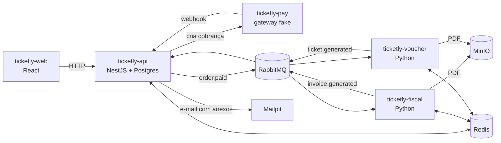

# Ticketly

Plataforma de venda de ingressos para shows, construída como **projeto de estudo de sistemas distribuídos**: microserviços que conversam por filas (RabbitMQ), com Redis para lock e controle de etapas.

## Propósito

O objetivo não é o e-commerce em si — é aprender, na prática, os problemas que aparecem quando um processo é dividido entre vários serviços:

- **Concorrência**: duas pessoas tentando comprar o mesmo assento ao mesmo tempo.
- **Comunicação assíncrona**: serviços que não se chamam direto, só trocam mensagens.
- **Falhas parciais**: o pagamento passou, mas a NF-e falhou — e agora?
- **Mensagens duplicadas**: a mesma mensagem chegando duas vezes não pode gerar duas NF-e.
- **Junção de resultados**: o e-mail final só sai quando NF-e **e** ingresso estiverem prontos, que são gerados em paralelo.

## O que o sistema faz

1. O cliente escolhe um show e os assentos — **sem precisar de login**.
2. Os assentos ficam reservados por 10 minutos enquanto ele paga.
3. Um gateway de pagamento (fake) aprova ou recusa a cobrança.
4. Com o pagamento aprovado, dois serviços trabalham **em paralelo**: um gera a NF-e (fake) em PDF, outro gera o ingresso com QR code.
5. Quando os dois terminam, o cliente recebe um e-mail com os dois PDFs anexados.
6. Um portal administrativo permite cadastrar shows e acompanhar cada pedido etapa por etapa.

## Arquitetura



Detalhes do fluxo, decisões e modelo do banco em [docs/arquitetura.md](docs/arquitetura.md). Formato das mensagens em [docs/eventos.md](docs/eventos.md).

## Repositórios

| Pasta | Papel | Stack | Status |
|---|---|---|---|
| [ticketly-api](ticketly-api) | API principal: catálogo, reservas, pedidos, pagamentos, envio do e-mail final | NestJS, MikroORM, Postgres | Esqueleto + Docker |
| [ticketly-web](ticketly-web) | Loja (cliente) e portal admin | React, Vite, TypeScript, shadcn/ui | Rotas, auth admin, base de serviços |
| [ticketly-fiscal](ticketly-fiscal) | Worker que gera o PDF da NF-e fake | Python 3.12, aio-pika, reportlab | Esqueleto + Docker |
| [ticketly-voucher](ticketly-voucher) | Worker que gera o ingresso em PDF com QR code | Python 3.12, aio-pika, reportlab, qrcode | Esqueleto + Docker |
| `ticketly-infra` | RabbitMQ, Redis, MinIO e Mailpit | Docker Compose | A fazer |
| `ticketly-pay` | Gateway de pagamento fake (simula o Asaas) | A definir | A fazer |

Cada repositório se gerencia sozinho: tem seu próprio `Dockerfile`, `Dockerfile.development`, `compose.development.yaml`, `compose.staging.yaml` e `.env.example`.

## Como rodar (desenvolvimento)

Todos os serviços se enxergam pela rede Docker `ticketly-net`. Crie uma vez:

```bash
docker network create ticketly-net
```

Depois suba cada parte, **nessa ordem**, a partir da pasta de cada uma:

```bash
cp .env.example .env
docker compose -f compose.development.yaml up -d
```

1. `ticketly-infra` (quando existir) — RabbitMQ, Redis, MinIO, Mailpit
2. `ticketly-api` — sobe junto o Postgres
3. `ticketly-fiscal` e `ticketly-voucher`
4. `ticketly-web`

| Serviço | Endereço |
|---|---|
| Front | http://localhost:5173 |
| API | http://localhost:3000 |
| Postgres | `localhost:5433` |

## Roadmap

1. **Infra** — `ticketly-infra` com RabbitMQ, Redis, MinIO e Mailpit.
2. **Catálogo** — entidades e seed de shows, setores e assentos.
3. **Reserva** — lock de assento no Redis + pedido `RESERVED`, expiração automática.
4. **Pagamento** — `ticketly-pay`, webhook, outbox publicando `order.paid`.
5. **Workers** — voucher primeiro (ponta a ponta), depois fiscal.
6. **Fulfillment** — junção dos dois resultados + e-mail com anexos.
7. **Resiliência** — retry, DLQ e idempotência testados de propósito (derrubar worker, duplicar webhook).
8. **Front** — loja com status do pedido em tempo real.
9. **Admin** — tela de pedidos (debug do fluxo) e CRUD de shows.
10. **Observabilidade** — correlationId nos logs, OpenTelemetry + Jaeger.
