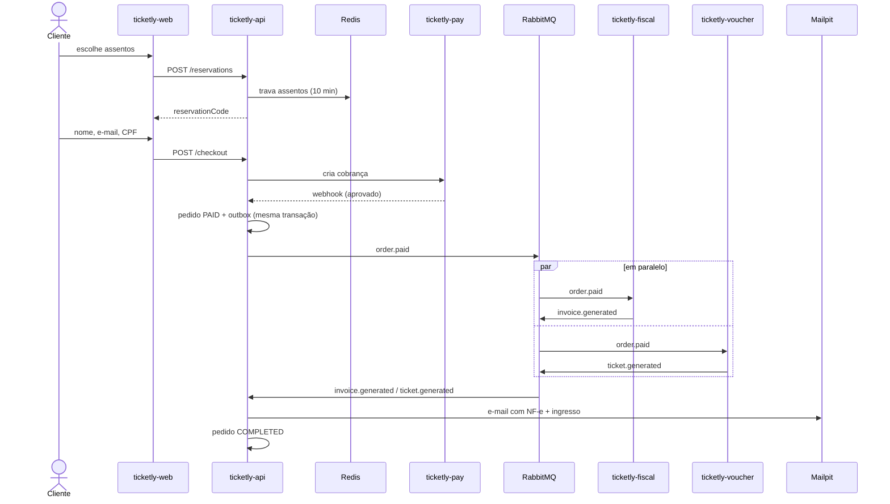
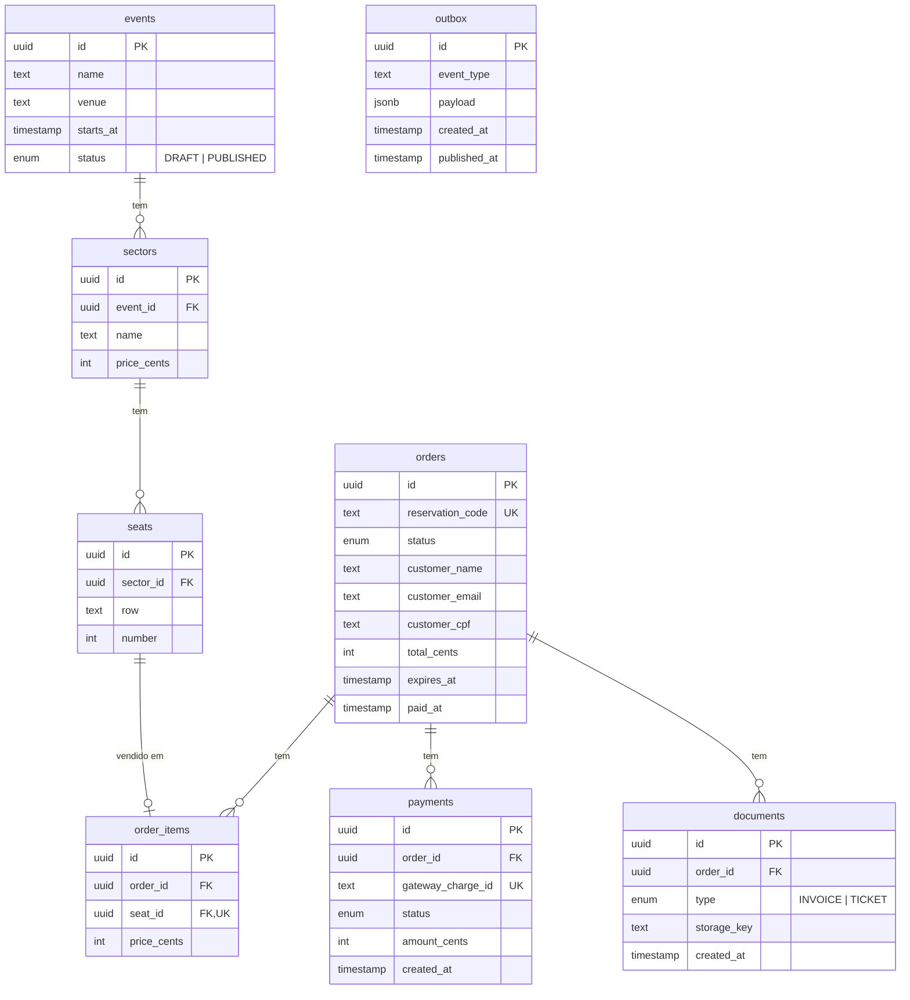

# Arquitetura

## Fluxo de uma compra



### Passo a passo

1. **Reserva** — o cliente escolhe os assentos, sem login. A API trava cada assento no Redis por 10 minutos (`SET NX EX`) e cria um pedido `RESERVED` com um `reservationCode` aleatório. Quem tem esse código é o dono da reserva.
2. **Checkout** — o cliente envia nome, e-mail, CPF e o `reservationCode`. A API cria a cobrança no gateway.
3. **Pagamento** — o gateway fake chama o webhook da API (aprovado ou recusado, com atraso aleatório).
4. **Publicação** — a API marca o pedido como `PAID` e grava o evento na tabela `outbox` **na mesma transação**. Um job publica a outbox no RabbitMQ.
5. **Processamento paralelo** — fiscal e voucher recebem cada um sua cópia de `order.paid`, geram o PDF, sobem no MinIO e publicam o resultado.
6. **Fulfillment** — a API registra cada documento. Quando os dois existem, envia o e-mail e marca `COMPLETED`.

### Status do pedido

```
RESERVED ──► PAID ──► COMPLETED
    │          │
    ▼          ▼
 EXPIRED     FAILED
```

- `EXPIRED`: não pagou em 10 minutos. Os assentos voltam a ficar livres.
- `FAILED`: pagamento recusado ou erro definitivo no processamento.

## Decisões

| Decisão | Por quê |
|---|---|
| Compra sem login | A reserva pertence ao pedido (via `reservationCode`), não a um usuário. Login só no admin. |
| Postgres só da API | Cada banco tem um dono só. Os workers não acessam o banco — tudo que precisam vem na mensagem. |
| Outbox | Garante que o evento só é publicado se o pedido foi salvo, e que não se perde se o RabbitMQ estiver fora. |
| Uma fila por worker | Cada worker recebe sua própria cópia da mensagem e processa em paralelo. |
| Envelope JSON próprio | Formato neutro entre Node e Python. Por isso não usamos o transport nativo do `@nestjs/microservices`. |
| Idempotência via Redis | O RabbitMQ pode entregar a mesma mensagem duas vezes. Cada worker anota `processed:{messageId}`. |
| Junção atômica | Os dois resultados podem chegar ao mesmo tempo. Um `UPDATE` condicional garante que só um deles dispara o e-mail. |
| PDFs no MinIO (S3) | Nada de pasta compartilhada entre containers. A mensagem carrega só a chave do arquivo. |
| Dinheiro em centavos (`int`) | Evita erro de arredondamento. `15000` = R$ 150,00. |
| Retry + DLQ | Falha temporária tenta de novo com espera; falha repetida vai pra uma fila de "mortos" para análise. |
| MikroORM | Unit of Work parecido com o Entity Framework (`em.flush()` ≈ `SaveChanges()`). |

## Modelo de dados (ticketly-api)



Regras importantes:

- `order_items.seat_id` é **único**: o banco impede que o mesmo assento entre em dois pedidos, mesmo se o lock do Redis falhar. Quando uma reserva expira, os itens dela são apagados e o assento fica livre.
- `documents` é único por `(order_id, type)`: um pedido tem no máximo uma NF-e e um ingresso.
- `outbox` não se relaciona com nada: é a caixa de saída de mensagens para o RabbitMQ.
- Depois: `admin_users` para o login do portal admin.

## Infraestrutura compartilhada

| Serviço | Uso | Quem usa |
|---|---|---|
| RabbitMQ | Mensagens entre serviços | api, fiscal, voucher |
| Redis | Lock de assento, idempotência, cache de etapas | api, fiscal, voucher |
| MinIO | Armazenamento dos PDFs | fiscal, voucher (gravam), api (lê) |
| Mailpit | Caixa de e-mail falsa para ver os e-mails enviados | api |
